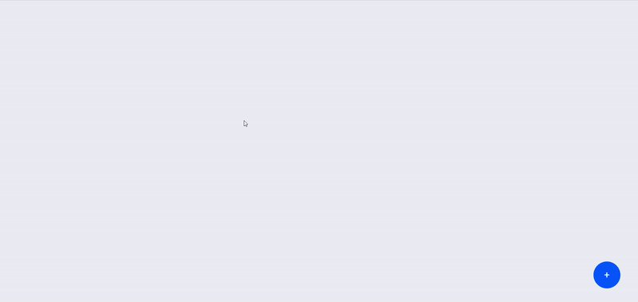
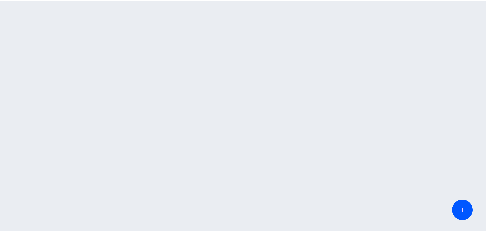
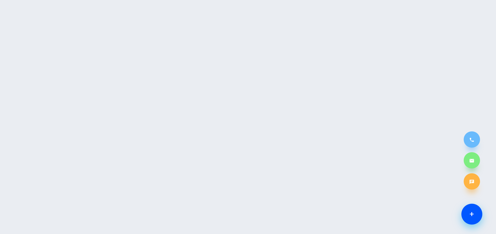

# ButtonPop | Floating Button

<a href="https://www.linkedin.com/in/dharmendraverma95/" target="_blank">LinkedIn Profile </a>

<a href="https://www.behance.net/dhirukumar" target="_blank">Behance Profile </a>

## Project Overview
ButtonPop is a dynamic, interactive floating button designed to enhance user experience by providing quick access to important actions. It seamlessly integrates into any web or mobile interface, offering convenience and simplicity by allowing users to perform actions with just one tap or click.

# Preview
ButtonPop | Floating Button
 

 
REST STATE
 

 
 
HOVER STATE
 

 

## Features

- **CSS-only animations**: No JavaScript required.
- **Icon Fade-In**: The page title fades in smoothly.
- **Animated Bars**: A set of bars fade in with a sequential animation.
- **Responsive Design**: The layout adjusts to different screen sizes.

###### Lang
<ul>
  <li>Graphic Design Software: Photoshop, Adobe XD (for mockups)</li>
  <li>Web Tools (Optional): HTML5, CSS3 for any digital presentations or landing pages</li>

</ul>

